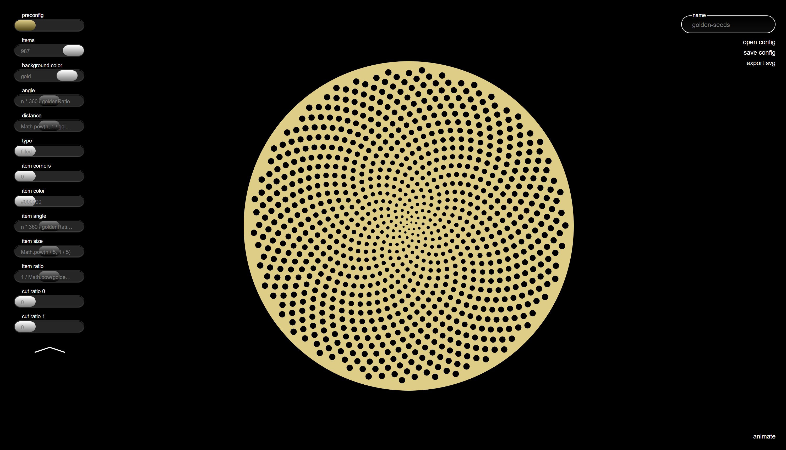

# GoldenSeeds
Application to generate SVGs based on mathematical rules

## Features
- work in simple mode (sliders) or expert mode (javascript-code)
- open / save configurations
- export SVG
- animation base on number of items over time

## how to use
### use offline version without build
download the Project, unzip it and open index.html in the dist folder with your browser

### for developers
download or clone the project. It is an npm project, so (install npm if not already installed, then) run "npm install" in the root folder and then "npm run start". Once the development server is started you can access the app on "localhost:8888"